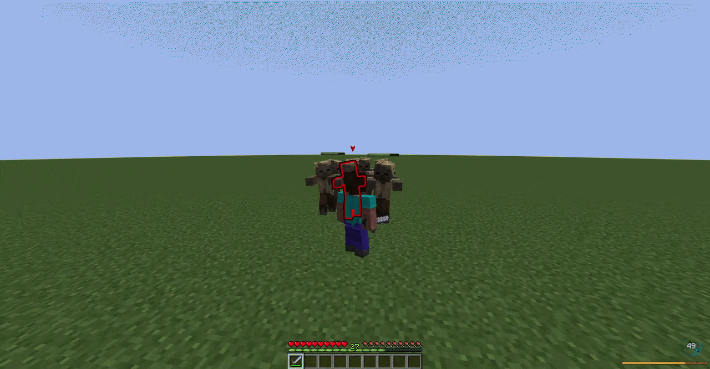

# Balanced Epic Fight

Source code for **Balanced Epic Fight**, a Minecraft Forge mod that makes some Epic Fight combat features more balanced.

---
## Features

**No more hit trading:** Mobs can no longer perform infinite attack loops. There is now a cooldown after their final basic attack. This cooldown duration dynamically increases based on the surrounding mob count and decreases based on the mob's maximum health.

**How it works:**

*   **Base Cooldown:** 2.0 seconds.
*   **Crowd Penalty:** The cooldown increases by 0.4 seconds for each additional mob around the player (starting from the 2nd mob). The maximum cooldown time is hard-capped at 5.0 seconds.
*   **Elite Adjustment:** The cooldown decreases by 0.01 seconds for every 1 point of max HP. This gives high-tier enemies like Endermen and Iron Golems shorter cooldowns, keeping them aggressive while standard mobs retain a normal cooldown.

| Before | After |
| :---: | :---: |
|  |  |

**Crowd combat:** Stamina cost is significantly decreased when the player is surrounded by a herd of mobs.

**How it works:**

*   **Dynamic Cost:** The stamina cost for all actions is automatically scaled using the formula: `Base Stamina / Mob Count`.
*   **Minimum Cost Cap:** To prevent infinite skill spamming and maintain game balance, the maximum stamina cost reduction is capped at 20% (you will never consume less than 20% of the original stamina cost, regardless of how many mobs are attacking you).

| Status | Demo |
| :---: | :---: |
| **Before** |  |
| **After** |  |

---
## Download
* Curseforge: https://www.curseforge.com/minecraft/mc-mods/balanced-epic-fight
* Modrinth: https://modrinth.com/mod/balanced-epic-fight

---
## Requirements

* Minecraft 1.20.1
* Forge
* Epic Fight 20.14.17 or above

## License

This project is licensed under GPL-3.0.
